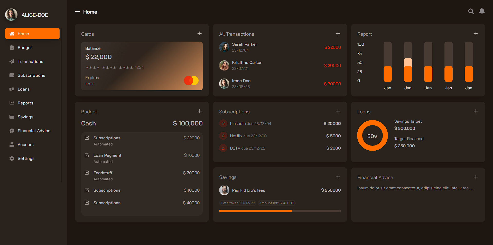

# Personal Finance Dashboard

A modern **Personal Banking Dashboard** built using **React.js**, designed to help users manage their finances effectively with a clean, dark-themed UI.



## Features

- **Interactive Dashboard**: A snapshot of the user's financial activities, including balance, transactions, budget, savings, and loans.
- **Navigation Menu**: Easy access to key sections like Budget, Transactions, Subscriptions, Loans, and Financial Advice.
- **Dynamic Reports**: Visual representation of financial performance and savings progress.
- **Subscriptions Management**: Track active subscriptions and their due dates.
- **Savings Tracker**: View savings goals, progress, and remaining targets.
- **Responsive Design**: Optimized for desktop and mobile devices.

## Technologies Used

- **Frontend**: React.js, React Router
- **Styling**: Tailwind CSS / SCSS / Styled Components
- **State Management**: Redux / Context API
- **Data Visualization**: Chart.js / Recharts
- **Backend**: Node.js (Optional, for API integration)
- **Deployment**: Vercel / Netlify

## Getting Started

### Prerequisites

Ensure you have the following installed:
- Node.js (>=14.x)
- npm or yarn

### Installation

1. Clone the repository:
   ```bash
   git clone  https://github.com/ARMANANS1218/Banking-Dashboard-react-pro
   cd personal-finance-dashboard
